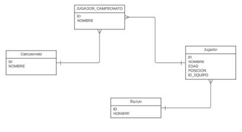

# Introducción a Spring Boot

## **Introducción:**

Spring Boot es una extensión de Spring, este último es un framework de desarrollo que permite crear aplicaciones empresariales robustas, escalables y seguras para Java, Kotlin y Groovy. Spring Boot simplifica aún más el desarrollo de aplicaciones al reducir la cantidad de configuración manual requerida y proporcionar características listas para usar.

Esto significa que, por la naturaleza del framework, se reduce la necesidad de configuración manual a través de convenciones y autoconfiguración, ayudando a que la programación sea más fácil e intuitiva.

Además, es ampliamente utilizado en el desarrollo de plataformas web, siendo uno de los frameworks más conocidos para el lenguaje que se enseña principalmente en la universidad: Java. Preferimos usar Spring Boot sobre el Spring tradicional, ya que este último requiere configuración explícita del contexto de aplicación y los beans, mientras que Spring Boot usa autoconfiguración.

Spring Boot se complementa con Spring Data JPA (Java Persistence API), un ecosistema que proporciona una capa de abstracción para interactuar con bases de datos relacionales y no relacionales como PostgreSQL. Este enfoque permite a los desarrolladores enfocarse en la lógica de la base de datos, reduciendo la cantidad de código necesario para operaciones CRUD.

El propósito de esta presentación es enseñar cómo utilizar Spring Boot y Spring Data JPA con PostgreSQL desde el editor IntelliJ mediante un ejemplo práctico.

---

## **Cifras:**

Empresas reconocidas que usan Spring en su arquitectura incluyen:

- **Netflix**: $31.6 mil millones  
- **eBay**: $9.8 mil millones  
- **Alibaba**: $125.5 mil millones  
- **BMW**: $132.2 mil millones  
- **IBM**: $60.5 mil millones  

---

## **Comparativa de Frameworks:**

**Spring Boot vs otros frameworks para Java:**

| Framework     | Ventajas                                               | Desventajas                                                                 |
|---------------|--------------------------------------------------------|-----------------------------------------------------------------------------|
| **Java EE**   | Basado en especificaciones estándar.                   | Configuración extensa y menor popularidad frente a Spring.                 |
| **Grails**    | Simplifica el desarrollo con un enfoque opinado.       | Documentación menos extensa que Spring.                                    |
| **Play**      | Paradigma reactivo moderno.                            | Puede ser desafiante para quienes prefieren enfoques tradicionales.        |
| **Micronaut** | Ligero y rápido para microservicios.                   | Comunidad más pequeña y menor popularidad en comparación con Spring.       |

---

## **Justificación:**

Elegimos Spring Boot por su popularidad, facilidad de uso, menor cantidad de código necesario y la amplia comunidad que lo respalda.



---

## **Spring Initializr:**

[Spring Initializr](https://start.spring.io) es una herramienta en línea que facilita la configuración inicial de proyectos Spring Boot. Proporciona una interfaz intuitiva donde puedes seleccionar dependencias, lenguaje, versión de Spring Boot, tipo de empaquetado, entre otros.  

### **Pasos para usar Spring Initializr:**
1. Accede a [Spring Initializr](https://start.spring.io).  
2. Configura las opciones del proyecto:  
   - **Project:** Maven o Gradle.  
   - **Language:** Java, Kotlin o Groovy.  
   - **Spring Boot Version:** Selecciona la versión deseada.  
3. Agrega dependencias necesarias como:  
   - **Spring Web** para APIs REST.  
   - **Spring Data JPA** para bases de datos.  
   - **PostgreSQL Driver** para conectarse a PostgreSQL.  
4. Descarga el proyecto generado y ábrelo en tu IDE preferido, como IntelliJ.  

### **Ventajas de Spring Initializr:**
- Ahorra tiempo al configurar proyectos.  
- Genera un código base limpio y estructurado.  
- Garantiza compatibilidad entre dependencias.  

---

## **API REST:**

### Principios REST:
- **Cliente-servidor**: Separación de responsabilidades.  
- **Sin estado**: Las solicitudes HTTP no dependen de estados previos.  
- **Cacheable**: Mejora el rendimiento al permitir almacenamiento en caché.  
- **Interfaz uniforme**: Uso de métodos estándar como `GET`, `POST`, `PUT` y `DELETE`.  
- **Recursos**: Representados por URIs únicos, como `/users` o `/orders`.  
- **Representación de recursos**: JSON, XML, HTML, etc.

### Ejemplo de peticiones:
1. **Obtener todos los jugadores**  
   - Método HTTP: `GET`  
   - URI: `/jugadores`  
   - Respuesta: JSON con la lista de jugadores.  

2. **Crear un jugador**  
   - Método HTTP: `POST`  
   - URI: `/jugadores`  
   - Cuerpo: JSON con los detalles del jugador.  

3. **Actualizar un jugador**  
   - Método HTTP: `PUT`  
   - URI: `/jugadores/{id}`  
   - Cuerpo: JSON con los datos actualizados.  

4. **Eliminar un jugador**  
   - Método HTTP: `DELETE`  
   - URI: `/jugadores/{id}`  

---

## **Configuración del Proyecto:**

### **Dependencias en Spring Boot:**
Spring Boot usa **starters** para simplificar la carga y gestión de dependencias, con el objetivo de agrupar las dependencias necesarias para cada funcionalidad en vez de agregar cada dependencia de manera manual. Algunos starters útiles incluyen:  
- **spring-boot-starter-web**: Para crear aplicaciones web y APIs REST.  
- **spring-boot-starter-data-jpa**: Para manejar operaciones con bases de datos.

Al descargar el archivo de [Spring Initializr](https://start.spring.io) con las dependencias necesarias para el proyecto, se genera un archivo **pom.xml**, el cual trae consigo todas las dependencias agrupadas.

### **Archivos de Configuración:**
1. **application.properties**: Configuración basada en un formato clave-valor.  
2. **application.yaml**: Configuración jerárquica en formato YAML, cuya sintáxis es sencilla y legible.  

### Ejemplo de configuración YAML:
```yaml
spring:
  datasource:
    url: jdbc:postgresql://localhost:5432/mi_base_datos
    username: postgres
    password: mi_contraseña
    driver-class-name: org.postgresql.Driver
  jpa:
    hibernate:
      ddl-auto: update
    show-sql: true
    properties:
      hibernate:
        format_sql: true
    database-platform: org.hibernate.dialect.PostgreSQLDialect
    mail:
      host: smtp.gmail.com
      port: 587 ##puerto por defecto
      username: tucorreo@gmail.com
      password: tucontraseña
      properties:
        mail.smtp.auth: true
        mail.smtp.starttls.enable: true
```

Adicionalmente, al final del anterior archivo de configuración .yaml se evidencia como se pueden configurar credenciales de correo en caso de ser necesarios envios de correo en la ejecución del programa (en el ejemplo se muestra como sería para una cuenta de correo @gmail).

